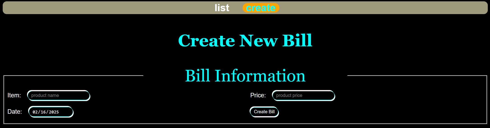
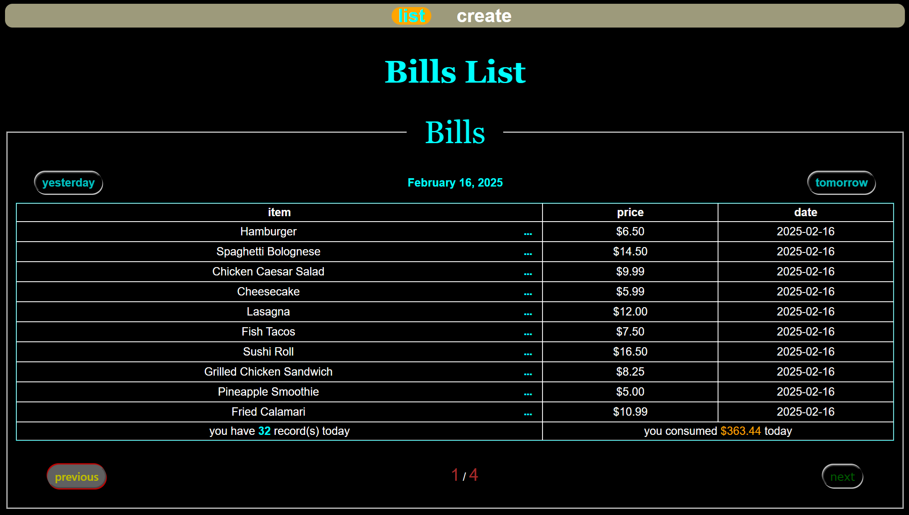
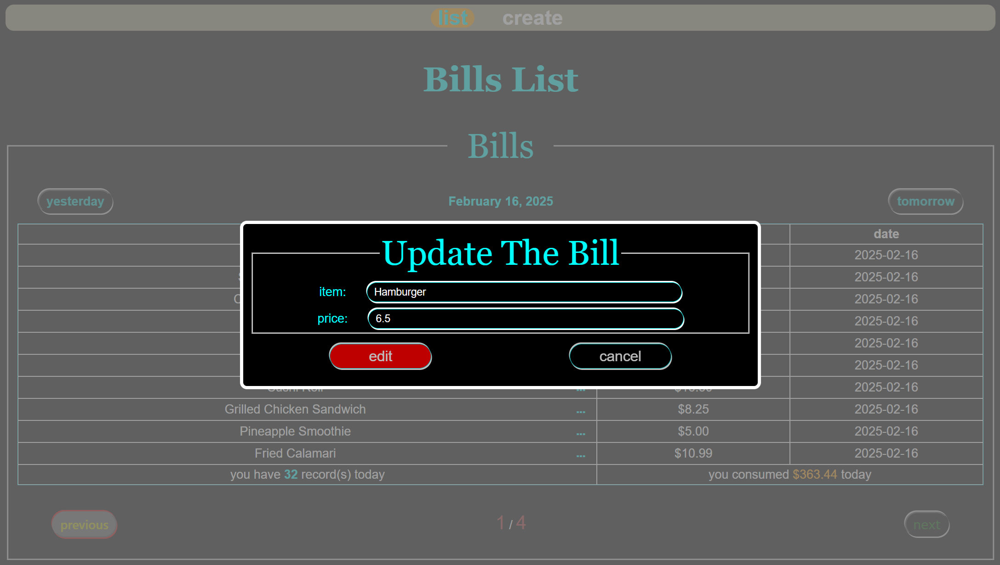
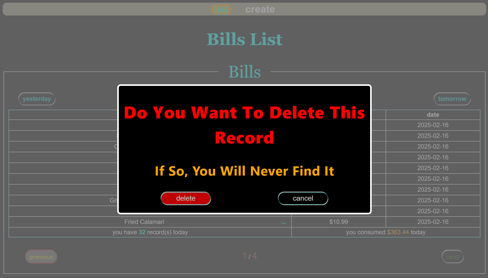

# Caesar-s-Bills
* An website to manage your bills

## Dependencies (for Windows)
* backend:
    1. JDK
        * [JDK Download Link](https://download.oracle.com/java/23/latest/jdk-23_windows-x64_bin.exe)
        * Verification:
            1. Open `Powershell` or `cmd`
            2. type this: `java -version`
            3. If the current version of your downloaded java is displayed, it proves you successfully installed the JDK
            4. If not, please reinstall it
    2. IDE
        * JetBrains IntelliJ IDEA
            * [JetBrains IntelliJ IDEA Community Version Download Link](https://www.jetbrains.com/idea/download/download-thanks.html?platform=windows&code=IIC)
            * Verification:
                1. if `JetBrains IntelliJ IDEA` is opened, it proves you successfully installed the IDE
                2. If not, please reinstall it
    3. Version Conctroller
        * Maven
            * [Maven Download Link](https://maven.apache.org/download.cgi)
            * Set Environment Variables:
                1. Open `Settings`
                2. Click `System` -> `About` -> `Advanced system settings`
                3. Go to `Path` variable, select `Edit` button
                4. Populate the directory of your installed maven path
            * Verification
                1. Open `Powershell` or `cmd`
                2. type this: `mvn -version`
                3. If the current version of your downloaded maven is displayed, it proves you successfully installed maven
                4. If not, please reinstall it
* frontend:
    * Browser
        * `Google Chrome`
            * [Google Chrome Download Link](https://www.google.com/chrome/)
    * IDE
        * `Microsoft Visual Studio Code`
            * [Micorosoft Visual Studio COde Download Link](https://code.visualstudio.com/download)
    * `node`
        * Open your `Powershell` or `cmd`
        * [Download `.msi` file](https://nodejs.org/dist/v22.14.0/node-v22.14.0-x64.msi)
        * Verification
            1. `node`: `node -v`
            2. `npm`: `npm -v`
    * `Vue` and `Vue-CLI`
        * Download: `npm install -g @vue/cli` 
        * Verification: `vue --version`
    * Install all dependencies of the frontend of the project
        1. Change directory to `caesar-s-billsPathOnYourComputer/frontend/bills` on your `powershell`
        2. type `npm install` to install all dependencies of the project
* database
    * [Download MySQL installer](https://dev.mysql.com/downloads/file/?id=536787)
    * Set root password to 123456, or other else but you need to change password on `Application.yml`
## Setup
1. `git clone https://github.com/CaesarLi-WantToBeAFreeMan/Caesar-s-Bills.git` on your git bash
2. `cd caesar-s-billsPathOnYourComputer/frontend/bills; npm run serve` on your `powershell` to open frontend UI
3. create a connection on your mysql workbench, and export my sql file to create `bills` table and insert data
4. open backend directory on you `JetBrains IntelliJ IDEA`, and go to `src\main\java\com\triblec\caesar\Application.java` then run it to open backend
## Screenshots
1. create
    * create a bill screenshot
    
2. read
    * read bills as a list screenshot
    
3. update
    * update a bill screenshot
    
4. delete
    * delete a bill screenshot
    